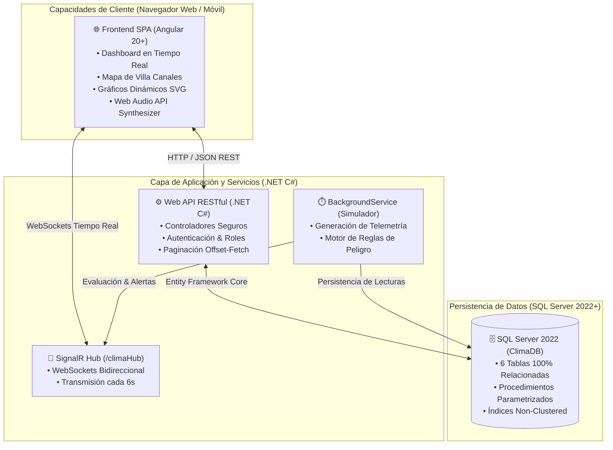

# 🛰️ ClimaSafe Rural - Sistema de Monitoreo y Alerta Temprana

> **Proyecto I - Desarrollo Web (2026)**  
> **Universidad Mariano Gálvez de Guatemala (UMG)**  
> **Facultad de Ingeniería en Sistemas de Información y Ciencias de la Computación**

[](https://angular.dev/)
[](https://dotnet.microsoft.com/)
[](https://www.microsoft.com/sql-server)
[](https://www.docker.com/)

---

## 👥 Integrantes del Equipo y Roles

| Integrante | Rol en el Proyecto | Responsabilidades Principales |
| :--- | :--- | :--- |
| **Christian González** (`maxair180`) | **Frontend Engineer** | Diseño UI/UX en Angular 20+, Cliente SignalR, Mapa Georreferenciado y Dashboard en tiempo real. |
| **Melannie Lorenzana** | **Backend Engineer** | API REST en C# .NET, Entity Framework Core, Hub de SignalR, Simulador en segundo plano y Motor de Alertas. |
| **Carlos Fernando Cachin** (`CACHIN1563`) | **Database & DevOps** | Diseño Relacional en SQL Server 2022, Procedimientos Almacenados, Paginación, Inmunidad SQL Injection y Docker Compose. |

---

## 📋 Descripción del Proyecto

**ClimaSafe Rural** es una plataforma web integral diseñada para la **gestión, monitoreo y alerta temprana de riesgos climáticos** en comunidades rurales del **Municipio de Villa Canales, Guatemala**.

El sistema procesa y proyecta en tiempo real variables meteorológicas críticas, evalúa automáticamente niveles de riesgo mediante un motor de inferencia, reproduce alertas visuales y sonoras, mantiene una bitácora inmutable de auditoría y permite a los administradores gestionar estaciones meteorológicas y restablecer el monitoreo preventivo.

---

## 🏗️ Arquitectura de la Solución



---

## 🌦️ Monitoreo Climático y Reglas de Alerta

El sistema monitorea **5 variables ambientales clave** clasificadas en **4 niveles de peligro**:

### 1. Variables Físicas Monitoreadas
1. 🌡️ **Temperatura Ambiente:** Margen seguro `10°C - 35°C`.
2. 💧 **Humedad Relativa:** Margen seguro `40% - 85%`.
3. 💨 **Velocidad del Viento:** Margen seguro `0 km/h - 45 km/h`.
4. 🌧️ **Nivel de Lluvia:** Margen seguro `0 mm - 35 mm`.
5. 🌊 **Nivel de Río / Reservorio:** Margen seguro `1.0 m - 4.5 m`.

### 2. Clasificación de Niveles de Peligro
* 🟢 **Verde (Normal):** Condiciones ambientales óptimas y estables.
* 🟡 **Amarillo (Precaución):** Fluctuación térmica o llovizna bajo observación.
* 🟠 **Naranja (Alerta):** Vientos fuertes o lluvia intensa persistente. Emite tono sonoro moderado (660 Hz).
* 🔴 **Rojo (Emergencia):** Peligro inminente (Desbordamiento, Huracán, Incendio o Helada extrema). Emite alarma sonora doble (880 Hz / 440 Hz) y pulso lumínico.

### 3. Fenómenos Registrados en el Historial
* 🌊 **Inundación** (Río $\ge 5.0$ m o Lluvia $\ge 80$ mm)
* ☀️ **Sequía** (Humedad $\le 15\%$ o Caudal $\le 0.8$ m)
* 🌪️ **Tormenta** (Viento $\ge 70$ km/h o Lluvia $\ge 50$ mm)
* ❄️ **Helada** (Temperatura $\le 0^\circ$C)
* 🔥 **Incendio Forestal** (Temperatura $\ge 40^\circ$C y Humedad $\le 20\%$)

---

## 🗺️ Mapa Georreferenciado de Villa Canales

El mapa interactivo posiciona dinámicamente estaciones en las **13 Aldeas Oficiales de Villa Canales**:
* **Zona Norte:** *Boca del Monte, El Porvenir, Chichimecas, El Tablón, Colmenas*.
* **Zona Centro:** *El Zapote, El Durazno, Santa Rosita, Santa Elena Barillas*.
* **Zona Sur:** *Los Dolores, Los Pocitos, El Jocotillo, El Obrajuelo*.

---

## 🗄️ Diseño de la Base de Datos (SQL Server 2022+)

El esquema relacional `database/schema.sql` implementa **6 tablas normalizadas**:

1. `dbo.Usuarios`: Credenciales, roles (`Administrador`, `Operador`) y auditoría.
2. `dbo.Sensores`: Estaciones meteorológicas geolocalizadas vinculadas a usuarios.
3. `dbo.Lecturas`: Registro continuo de telemetría con clave foránea a `Sensores`.
4. `dbo.Alertas`: Registro de alertas generadas y usuario que atendió la emergencia.
5. `dbo.HistorialEventos`: Incidentes categorizados por fenómeno climático.
6. `dbo.BitacoraAcciones`: Auditoría inmutable de todas las acciones del sistema.

### Procedimientos Almacenados Seguros (Anti-SQL Injection)
* `sp_ReiniciarMonitoreo`: Reinicio atómico (`BEGIN TRANSACTION / TRY...CATCH`), reactivación de sensores y bitácora.
* `sp_ObtenerHistorialPaginado`: Paginación mediante `OFFSET @Offset ROWS FETCH NEXT @TamanoPagina ROWS ONLY`.
* `sp_ObtenerBitacoraPaginada`: Paginación optimizada para auditoría.

---

## 🔑 Credenciales de Acceso para Evaluación

| Usuario | Correo Electrónico | Contraseña | Rol / Permisos |
| :--- | :--- | :--- | :--- |
| **Administrador** | `ccachinm@miumg.edu.gt` | `admin123` | Control total, agregar sensores y reinicio de monitoreo. |
| **Operador de Monitoreo** | `operador@miumg.edu.gt` | `operador123` | Visualización en vivo y atención de alertas. |

---

## 🚀 Guía de Instalación y Ejecución

### Opción A: Despliegue con Docker Compose (Recomendado para Evaluación y VPS)

Requisitos: **Docker Desktop** instalado y en ejecución.

1. Clonar el repositorio:
   ```bash
   git clone https://github.com/maxair180/alerta-temprana-clima.git
   cd alerta-temprana-clima/docker
   ```

2. Construir y levantar los 3 contenedores:
   ```bash
   docker compose up --build -d
   ```

3. Abrir en el navegador:
   * **Frontend Web (Nginx):** `http://localhost:4200` o `http://localhost:80`
   * **Backend API REST (.NET):** `http://localhost:5000`
   * **SQL Server 2022 (Linux):** `localhost:1433` (Usuario: `sa`, Clave: `ClimaDB_Secure2026!`)

---

### Opción B: Ejecución en Entorno Local de Desarrollo

#### 1. Base de Datos:
Ejecutar el script `database/schema.sql` en SQL Server Management Studio (SSMS) o por línea de comandos:
```powershell
sqlcmd -S .\SQLEXPRESS02 -E -f 65001 -i database/schema.sql
```

#### 2. Backend Web API (.NET):
```powershell
cd backend/ClimaApi
dotnet run
```
*API iniciará en `http://localhost:5000`*

#### 3. Frontend SPA (Angular 20+):
```powershell
cd frontend/clima-app
npm install
node serve.js
```
*Aplicación disponible en `http://localhost:4200`*

---

## 🧪 Cumplimiento de Consideraciones de Evaluación

* ✅ **Correcto funcionamiento del sistema:** Telemetría en vivo, alarmas sonoras, mapa y reinicio validados.
* ✅ **Arquitectura limpia:** Separación estricta de capas (Presentation, Business Logic, Data Access).
* ✅ **Angular 20+ & .NET 10+:** Uso de Signals, Standalone Components, RxJS, Dependency Injection y EF Core.
* ✅ **Tiempo real con SignalR:** WebSockets bidireccionales con reconexión automática.
* ✅ **Persistencia y Calidad de BD:** Claves foráneas, índices de alto rendimiento y paginación `OFFSET-FETCH`.
* ✅ **Seguridad:** Consultas 100% parametrizadas, sanitización de entradas y login por roles.
* ✅ **UI/UX y Responsividad:** Diseño minimalista con modo oscuro adaptable a escritorio y dispositivos móviles.
* ✅ **Contenedores Docker:** Empaquetado completo con Dockerfiles y `docker-compose.yml` para servidores GNU/Linux.

---

*Desarrollado para el curso de **Desarrollo Web (2026)** — Universidad Mariano Gálvez de Guatemala.*
